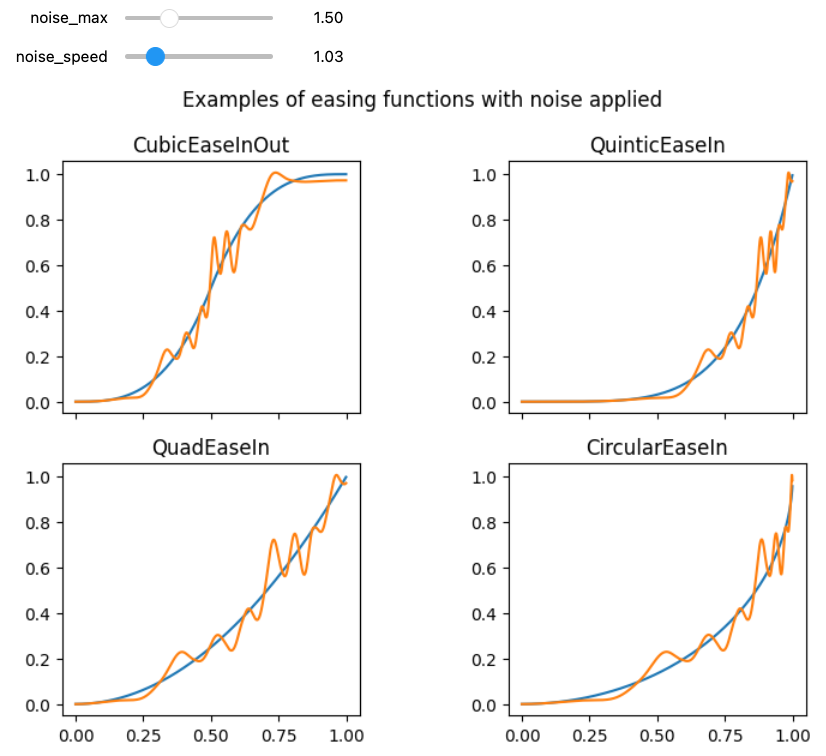

# Easeflow

Generate synthetic data that looks almost too good to be true.

It combines easing functions with Perlin noise to generate number series.

## Visualizing combinations of easing functions with Perlin noise
This example highlights two of the core principles adopted to generated usage data:  
1. easing_functions to generate numbers between a (min,max) that follow a easing function; see https://easings.net/ to get a feeling of how easing functions look like. Most of the examples in easings.net have a parallel in the `easing_functions` library  
2. Using Perlin noise add variation to the curve. If you're new to Perlin noise: https://en.wikipedia.org/wiki/Perlin_noise

